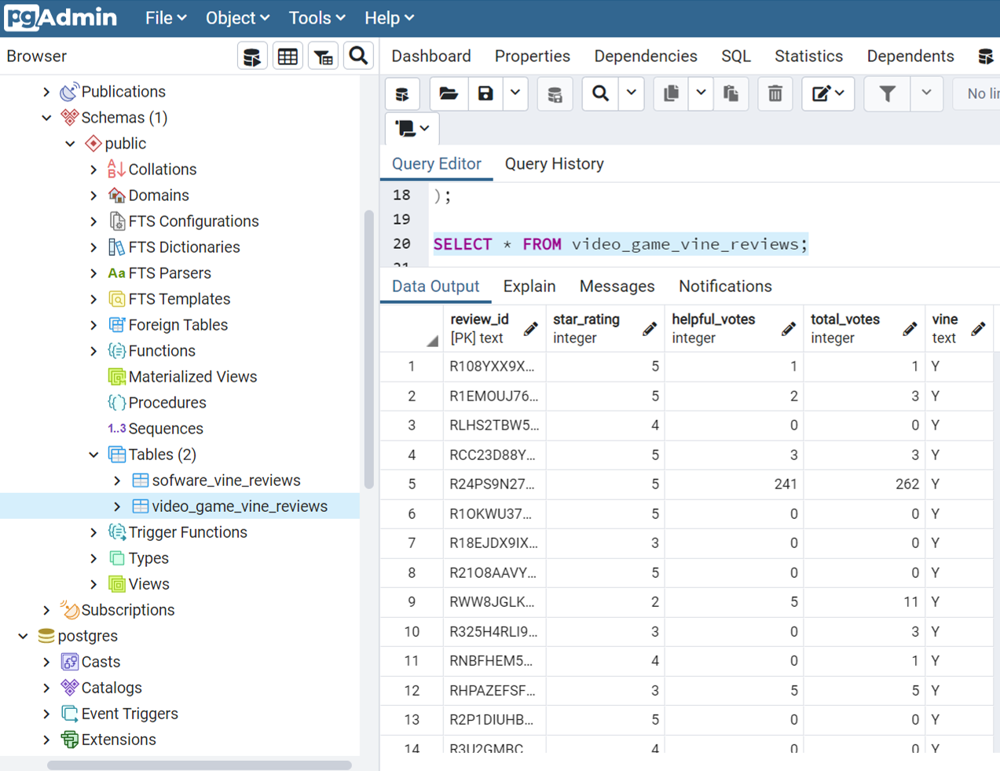

# "Alexa, can you handle big data?"

## Background
Amazon's shoppers depend on product reviews when making a purchase. While Amazon makes these datasets publicly available, it can exceed the capacity of average local machines to handle the data that has over 1.5 million rows; with over 40 datasets. The goal is to perform the ETL process in the cloud and upload a DataFrame to an RDS instance, and to perform a statistical analysis of selected data.

## Instructions
### Level 1
* Use the furnished schema to create tables in RDS database.
* Create two separate Google Colab notebooks.
* **Extract** two datasets from the [Review Dataset](https://s3.amazonaw.com/amazon-reviews-pds/tsv/index.txt), and count the number of reviews.
* **Transform** the dataset to fit the tables in the [Schema File](level-1/schema.sql).
* **Load** the DataFrames that correspond to tables into an RDS instance.

### Level 2
Investigate whether Amazon's Vine Customer Reviews are free of bias by using either PySpark or SQL to analyze the data. 

  

Number of records (number of vine reviews): 1. Video Games: 1,785,886 (4,290) 2. Software: 341,913 (10,415)  
Despite the number of records for the video games were higher than that of the software, the total Vine reviews for video games was lower than the software. The result analysis indicates that the Vine reviewers tend to provide high star ratings (4 or 5) while there are limited records that are labled as "helpful votes". It can be concluded that the Amazon's Vine program may not always be trustworthy.

 
## Further Considerations
* Delete RDS password and endpoint when uploading the Jupyter Notebooks: [Level 1](level-1) and [Level 2](level-2)
* Make sure to clean up all AWS resources by referring to [AWS cleanup guide](Resources/AWS_cleanup.pdf) and [AWS check billing guide](Resources/AWS_check_billing.pdf)
